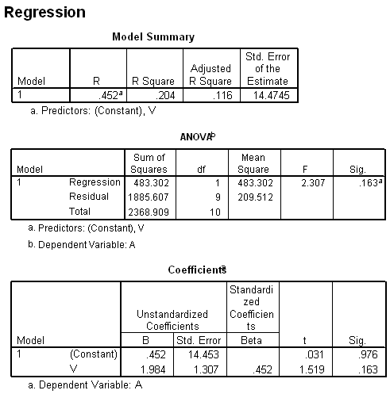

```{r, echo = FALSE, results = "hide"}
include_supplement("uva-simple-linear-regression-508-nl-graph01.png", recursive = TRUE)
```

Question
========

An assumption in this regression analysis is, that the observations are spread lie around the true regression line according to a normal distribution with equal variances over the entire range of observations. The best estimate of this variance is equal to



Answerlist
----------

* 14.4745
* 14.453
* 209.512
* 483.302

Solution
========

Answerlist
----------

* 14.4745: Incorrect
* 14.453: Incorrect
* 209,512: Correct
* 483,302: Incorrect

Meta-information
================
exname: uva-simple-linear-regression-508-en
extype: schoice
exsolution: 0010
exsection: Inferential Statistics/Regression/Simple linear regression
exextra[ID]: fb7d8
exextra[Type]: Conceptual, Calculation
exextra[Language]: English
exextra[Level]: Statistical Literacy
exextra[IRT-Difficulty]: 3.509
exextra[p-value]: 0.2233
