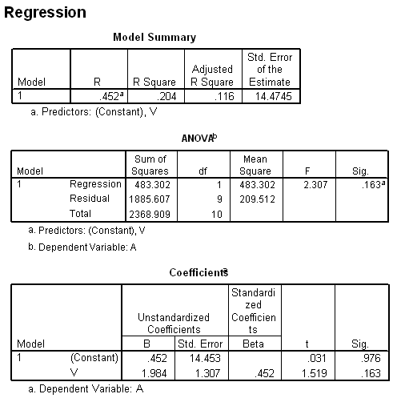

```{r, echo = FALSE, results = "hide"}
include_supplement("uva-simple-linear-regression-508-nl-graph01.png", recursive = TRUE)
```

Question
========

Een aanname bij deze regressieanalyse is, dat de waarnemingen gespreid
liggen rondom de werkelijke regressielijn volgens een normale verdeling
met gelijke varianties over de gehele range van waarnemingen. De beste
schatting van deze variantie is gelijk aan



Answerlist
----------

* 14.4745
* 14.453
* 209.512
* 483.302

Solution
========

Answerlist
----------

* 14.4745: Incorrect
* 14.453: Incorrect
* 209.512: Correct
* 483.302: Incorrect

Meta-information
================
exname: uva-simple-linear-regression-508-nl
extype: schoice
exsolution: 0010
exsection: Inferential Statistics/Regression/Simple linear regression
exextra[Type]: Conceptual, Calculation
exextra[Language]: Dutch
exextra[Level]: Statistical Literacy
exextra[IRT-Difficulty]: 3.509
exextra[p-value]: 0.2233
