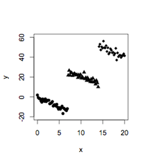

```{r, echo = FALSE, results = "hide"}
include_supplement("uva-simple-linear-regression-788-nl-graph01.png", recursive = TRUE)
```

Question
========

Research on the effect of the drug Koburol on patients with psychosis yields a positive correlation between the dose (*x*) of Koburol and how well the patient feels (*y*). The test on the slope parameter indicates that the relationship is significant. The researchers note that there are three different age groups of patients: 21-25, 26-30 and 31-35 years. These three groups are depicted in circles, triangles and diamonds. Then the researchers create a scatterplot of the data. This figure indicates



Answerlist
----------

* Regression to the mean
* Bivariate correlation
* Simpson's paradox

Solution
========

Answerlist
----------

* Regression to the mean: Incorrect
* Bivariate correlation: Incorrect
* Simpson's paradox: Correct

Meta-information
================
exname: uva-simple-linear-regression-788-en
extype: schoice
exsolution: 001
exsection: Inferential Statistics/Regression/Simple linear regression
exextra[Type]: Conceptual
exextra[Language]: English
exextra[Level]: Statistical Literacy
exextra[IRT-Difficulty]: 5.2
exextra[p-value]: 0.0083
