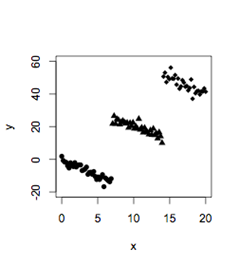

```{r, echo = FALSE, results = "hide"}
include_supplement("uva-simple-linear-regression-788-nl-graph01.png", recursive = TRUE)
```

Question
========

Onderzoek naar de werking van het medicijn Koburol op patiënten met een
psychose levert een positieve correlatie op tussen de dosis (*x*) van
Koburol en hoe goed de patiënt zich voelt (*y*). De toets op de
hellingparameter geeft aan dat de relatie significant is. De
onderzoekers merken op dat er drie verschillende leeftijdsgroepen van
patiënten zijn: 21-25, 26-30 en 31-35 jaar. Deze drie groepen zijn
afgebeeld in cirkels, driehoeken en ruiten. Dan maken de onderzoekers
een scatterplot van de data. Dit figuur wijst op



Answerlist
----------

regressie naar het gemiddelde
bivariate correlatie
Simpson's paradox

Solution
========

Answerlist
----------

regressie naar het gemiddelde: Incorrect
bivariate correlatie: Incorrect
Simpson's paradox: Correct

Meta-information
================
exname: uva-simple-linear-regression-788-nl
extype: schoice
exsolution: 001
exsection: Inferential Statistics/Regression/Simple linear regression
exextra[Type]: Conceptual
exextra[Language]: Dutch
exextra[Level]: Statistical Literacy
exextra[IRT-Difficulty]: 5.2
exextra[p-value]: 0.0083
