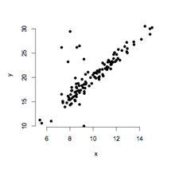

```{r, echo = FALSE, results = "hide"}
include_supplement("uva-simple-linear-regression-794-nl-graph01.png", recursive = TRUE)
```

Question
========

To investigate whether a relationship exists between *x* and *y*, a regression analysis is performed. The directional coefficient is tested and is found to be significant. The values for *x* and *y* are plotted in the graph below. The graph shows that probably an assumption has been violated. This is the assumption that states that



Answerlist
----------

* The population mean of y is linearly related to x.
* The population standard deviation of y is the same across all values of x.
* The values of x and y are randomly drawn from the population.

Solution
========

Answerlist
----------

* The population mean of y is linearly related to x.: Incorrect
* The population standard deviation of y is the same across all values of x.: Incorrect: Correct
* The values of x and y are drawn randomly from the population...: Incorrect

Meta-information
================
exname: uva-simple-linear-regression-794-en
extype: schoice
exsolution: 010
exsection: Inferential Statistics/Regression/Simple linear regression
exextra[ID]: 06937
exextra[Type]: Conceptual
exextra[Language]: English
exextra[Level]: Statistical Literacy
exextra[IRT-Difficulty]: 5.046
exextra[p-value]: 0.0098
