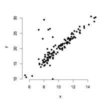

```{r, echo = FALSE, results = "hide"}
include_supplement("uva-simple-linear-regression-794-nl-graph01.png", recursive = TRUE)
```

Question
========

Om te onderzoeken of er een relatie bestaat tussen *x* en *y*, wordt een
regressieanalyse uitgevoerd. De richtingscoëfficiënt wordt getoetst en
blijkt significant. De waarden voor *x* en *y* zijn uitgezet in de
onderstaande grafiek. Uit de grafiek blijkt dat waarschijnlijk een
assumptie geschonden is. Het gaat om de assumptie die stelt dat



Answerlist
----------

* het populatiegemiddelde van y lineair gerelateerd is aan x.
* de populatie standaarddeviatie van y hetzelfde is over alle waarden van x.
* de waarden van x en y random zijn getrokken uit de populatie.

Solution
========

Het correcte antwoord is: 

* de populatie standaarddeviatie van y hetzelfde is over alle waarden van x.

Meta-information
================
exname: uva-simple-linear-regression-794-nl
extype: schoice
exsolution: 010
exsection: Inferential Statistics/Regression/Simple linear regression
exextra[Type]: Conceptual
exextra[Language]: Dutch
exextra[Level]: Statistical Literacy
exextra[IRT-Difficulty]: 5.046
exextra[p-value]: 0.0098
