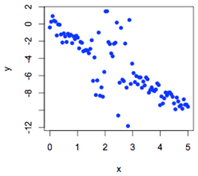

```{r, echo = FALSE, results = "hide"}
include_supplement("uva-simple-linear-regression-886-nl-graph01.png", recursive = TRUE)
```

Question
========

To examine whether a relationship exists between the variables x and y a regression analysis is performed. Before the analysis is performed, a number of assumptions for testing for regression coefficients are checked. First, the values of x and y are plotted on a graph. From the graph, it seems likely the assumption of regression violated which states that



Answerlist
----------

* The population standard deviation of y must be the same for all values of x.
* The population mean of y is linearly related to x.
* The population distribution of y is normally distributed for each x.

Solution
========

Answerlist
----------

* The population standard deviation of y must be the same for all values of x.: Correct
* The population mean of y is linearly related to x.: Incorrect
* The population distribution of y for each x is normally distributed...: Incorrect

Meta-information
================
exname: uva-simple-linear-regression-886-en
extype: schoice
exsolution: 100
exsection: Inferential Statistics/Regression/Simple linear regression
exextra[Type]: Conceptual
exextra[Language]: English
exextra[Level]: Statistical Literacy
exextra[IRT-Difficulty]: 4.486
exextra[p-value]: 0.0191
