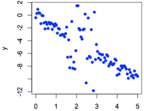

```{r, echo = FALSE, results = "hide"}
include_supplement("uva-simple-linear-regression-91-nl-graph01.png", recursive = TRUE)
```

Question
========

Om te onderzoeken of er een relatie bestaat tussen de variabelen x en y
wordt een regressie-analyse uitgevoerd. Voordat de analyse wordt
uitgevoerd, wordt een aantal assumpties voor het toetsen op
regressiecoëfficiënten gecontroleerd. Als eerste worden de waarden van x
en y in een grafiek uitgezet. Uit de grafiek lijkt waarschijnlijk de
assumptie van regressie geschonden die stelt



Answerlist
----------

* dat de populatiestandaarddeviatie van y hetzelfde moet zijn voor alle waarden van x.
* dat het populatiegemiddelde van y lineair gerelateerd is aan x.
* dat de populatieverdeling van y voor iedere x normaal verdeeld is.

Solution
========

Answerlist
----------

* dat de populatiestandaarddeviatie van y hetzelfde moet zijn voor alle waarden van x.: Correct
* dat het populatiegemiddelde van y lineair gerelateerd is aan x.: Incorrect
* dat de populatieverdeling van y voor iedere x normaal verdeeld is.: Incorrect

Meta-information
================
exname: uva-simple-linear-regression-91-nl
extype: schoice
exsolution: 100
exsection: Inferential Statistics/Regression/Simple linear regression
exextra[ID]: 49ae0
exextra[Type]: Conceptual
exextra[Language]: Dutch
exextra[Level]: Statistical Literacy
exextra[IRT-Difficulty]: 4.006
exextra[p-value]: 0.1145
