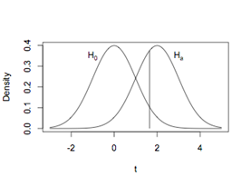

```{r, echo = FALSE, results = "hide"}
include_supplement("uva-statistical-errors-783-nl-graph01.png", recursive = TRUE)
```

Question
========

Er wordt getoetst op een gemiddelde. De nulhypothese is dat het
gemiddelde 0 is en de alternatieve hypothese dat het gemiddelde groter
dan 0 is. In de figuur zijn de nulhypothese en een specifieke
alternatieve hypothese getekend. De kansen links van de van de verticale
lijn onder de alternatieve hypothese en rechts van de verticale lijn
onder de nulhypothese zijn respectievelijk



Answerlist
----------

* Power en Type I fout.
* Type II fout en Type I fout.
* Type II fout en power.

Solution
========

Answerlist
----------

* Power en Type I fout.: Incorrect
* Type II fout en Type I fout.: Correct
* Type II fout en power.: Incorrect

Meta-information
================
exname: uva-statistical-errors-783-nl
extype: schoice
exsolution: 010
exsection: Inferential Statistics/NHST/Statistical errors
exextra[ID]: 1467c
exextra[Type]: Conceptual
exextra[Language]: Dutch
exextra[Level]: Statistical Literacy
exextra[IRT-Difficulty]: -1.873
exextra[p-value]: 0.9593
