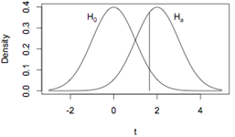

```{r, echo = FALSE, results = "hide"}
include_supplement("uva-statistical-errors-94-nl-graph01.png", recursive = TRUE)
```

Question
========

A mean is tested. The null hypothesis is that the mean is 0 and the alternative hypothesis that the mean is greater than 0. In the figure, the null hypothesis and a specific alternative hypothesis are drawn. The probabilities to the left of the of the vertical line under the alternative hypothesis and to the right of the vertical line below the null hypothesis are, respectively



Answerlist
----------

* Power and Type I error.
* Type II error and Type I error.
* Type II error and power.

Solution
========

Answerlist
----------

* Power and Type I error...: Incorrect
* Type II error and Type I error...: Correct
* Type II error and power...: Incorrect

Meta-information
================
exname: uva-statistical-errors-94-en
extype: schoice
exsolution: 010
exsection: Inferential Statistics/NHST/Statistical errors
exextra[ID]: 2e663
exextra[Type]: Conceptual
exextra[Language]: English
exextra[Level]: Statistical Literacy
exextra[IRT-Difficulty]: 0.24
exextra[p-value]: 0.918
