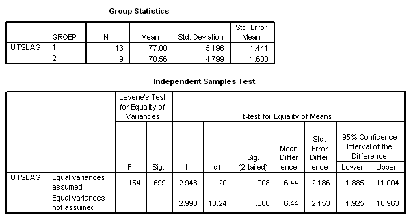

```{r, echo = FALSE, results = "hide"}
include_supplement("uva-test-278-nl-graph01.png", recursive = TRUE)
```

Question
========

If we were to perform an F-test for equality of variances here perform, then the value of the test quantity would be equal to



Answerlist
----------

* 1.08
* 1.11
* 1.17
* 1.23

Solution
========

Answerlist
----------

* 1.08: Incorrect
* 1.11: Incorrect
* 1.17: Correct
* 1.23: Incorrect

Meta-information
================
exname: uva-test-278-en
extype: schoice
exsolution: 0010
exsection: Inferential Statistics/Parametric Techniques/ANOVA/ANOVA F-test
exextra[ID]: 5cb35
exextra[Type]: Calculation
exextra[Language]: English
exextra[Level]: Statistical Literacy
exextra[IRT-Difficulty]: 6.379
exextra[p-value]: 5e-04
