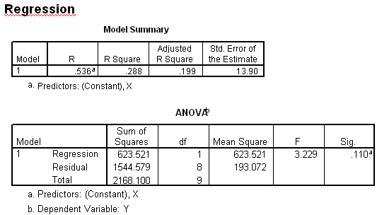

```{r, echo = FALSE, results = "hide"}
include_supplement("uva-test-411-nl-graph01.png", recursive = TRUE)
```

Question
========

Below is SPSS output from a regression analysis of Y on X. The p-value, belonging to the test of the null hypothesis that X has no linear effect on Y, is equal to



Answerlist
----------

* 0.002
* 0.11
* 0.199
* 0.276

Solution
========

Answerlist
----------

* 0.002: Incorrect
* 0.11: Correct
* 0.199: Incorrect
* 0.276: Incorrect

Meta-information
================
exname: uva-test-411-en
extype: schoice
exsolution: 0100
exsection: Inferential Statistics/Regression/Coefficient t-test
exextra[ID]: ba370
exextra[Type]: Interpreting output, Calculation
exextra[Language]: English
exextra[Level]: Statistical Literacy
exextra[IRT-Difficulty]: 0.005
exextra[p-value]: 0.9232
