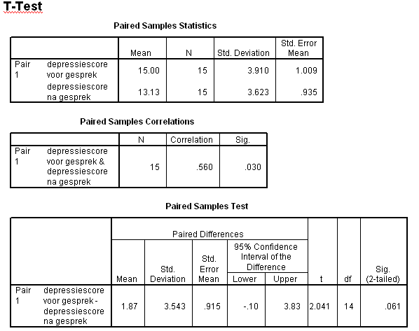

```{r, echo = FALSE, results = "hide"}
include_supplement("uva-test-for-correlation-331-nl-graph01.png", recursive = TRUE)
```

Question
========

Hieronder staat SPSS-uitvoer van een gepaarde T-toets op depressiescores
van 15 patiënten, gemeten voor en na een gesprek met een therapeut.
Wanneer we geïnteresseerd zijn in de vraag of de scores voor en na het
gesprek afhankelijk zijn moet de conclusie luiden:



Answerlist
----------

* Verwerp de nulhypothese dat ze afhankelijk zijn.
* Verwerp de nulhypothese dat ze onafhankelijk zijn.
* Verwerp de nulhypothese dat ze afhankelijk zijn niet.
* Verwerp de nulhyp

Solution
========

Answerlist
----------

* Verwerp de nulhypothese dat ze afhankelijk zijn.: Incorrect
* Verwerp de nulhypothese dat ze onafhankelijk zijn.: Correct
* Verwerp de nulhypothese dat ze afhankelijk zijn niet.: Incorrect
* Verwerp de nulhyp: Incorrect

Meta-information
================
exname: uva-test-for-correlation-331-nl
extype: schoice
exsolution: 0100
exsection: Inferential Statistics/Parametric Techniques/t-test/Test for correlation
exextra[ID]: aae15
exextra[Type]: Interpreting output
exextra[Language]: Dutch
exextra[Level]: Statistical Literacy
exextra[IRT-Difficulty]: 3.17
exextra[p-value]: 0.2553
