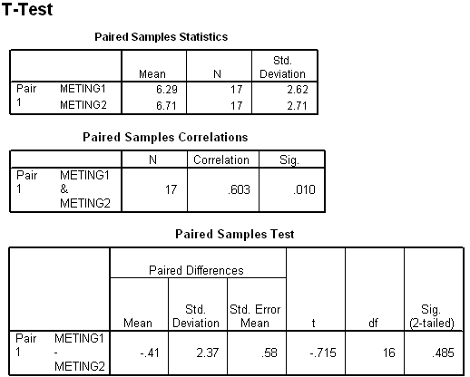

```{r, echo = FALSE, results = "hide"}
include_supplement("uva-test-for-correlation-506-nl-graph01.png", recursive = TRUE)
```

Question
========

Below is a portion of the SPSS output from a paired T-test on two measurements on 17 people. When testing the null hypothesis that the two measurements are not *consistent*, the conclusion should be (at α
= 5%, two-sided):



Answerlist
----------

* A significant result, H0 is rejected
* One significant result, H0 is not rejected
* No significant result, H0 is rejected
* No significant result, H0 is not rejected

Solution
========

Answerlist
----------

* A significant result, H0 is rejected: Correct
* A significant result, H0 is not rejected: Incorrect
* No significant result, H0 is rejected: Incorrect
* No significant result, H0 is not rejected: Incorrect

Meta-information
================
exname: uva-test-for-correlation-506-en
extype: schoice
exsolution: 1000
exsection: Inferential Statistics/Parametric Techniques/t-test/Test for correlation
exextra[Type]: Interpreting output
exextra[Language]: English
exextra[Level]: Statistical Literacy
exextra[IRT-Difficulty]: 2.488
exextra[p-value]: 0.4703
