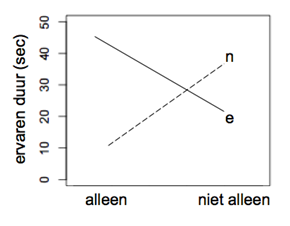

```{r, echo = FALSE, results = "hide"}
include_supplement("uva-twoway-anova-107-nl-graph01.png", recursive = TRUE)
```

Question
========

There is an idea that everyone has an internal clock that is affected by circumstances. For example, you may experience as a prolonged event, when in reality the event was of short duration. In research on what affects this internal clock then affects, two factors are considered: factor A: emotional/neutral stimuli presented, and factor B: someone else was in the room with the subject/no one else was in the room with the subject. They then measured self-reports about the perceived time of the subjects that an event lasted. Below is a figure of the results in averages for each of the 4 possible combinations of factor A and B. Given this figure and that the interaction effect is significant, what is a good interpretation of the data?



Answerlist
----------

* An emotional stimulus leads to longer reported perceived duration of an event than a neutral stimulus.
* An emotional stimulus leads to longer reported experienced duration of an event than a neutral stimulus when a person is alone; this pattern reverses when a person is not alone.
* An emotional stimulus leads to shorter reported perceived duration of an event than a neutral stimulus when a person is alone; this pattern reverses when a person is not alone.

Solution
========

Answerlist
----------

* An emotional stimulus leads to longer reported perceived duration of an event than a neutral stimulus: Incorrect
* An emotional stimulus leads to longer reported perceived duration of an event than a neutral stimulus when a person is alone; this pattern reverses when a person is not alone...: Correct
* An emotional stimulus leads to shorter reported perceived duration of an event than a neutral stimulus when a person is alone; this pattern reverses when a person is not alone...: Incorrect

Meta-information
================
exname: uva-twoway-anova-107-en
extype: schoice
exsolution: 010
exsection: Inferential Statistics/Parametric Techniques/ANOVA/Twoway ANOVA
exextra[Type]: Conceptual
exextra[Language]: English
exextra[Level]: Statistical Literacy
exextra[IRT-Difficulty]: 2.024
exextra[p-value]: 0.5719
