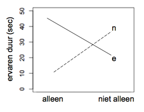

```{r, echo = FALSE, results = "hide"}
include_supplement("uva-twoway-anova-107-nl-graph01.png", recursive = TRUE)
```

Question
========

Er is een idee dat iedereen een interne klok heeft die wordt beïnvloed
door omstandigheden. Zo kun je bijvoorbeeld een emotionele gebeurtenis
ervaren als een langdurige gebeurtenis, terwijl in werkelijkheid de
gebeurtenis van korte duur was. In onderzoek naar wat deze interne klok
dan beïnvloedt, wordt gekeken naar twee factoren: factor A:
emotionele/neutrale stimuli gepresenteerd, en factor B: iemand anders
was in de kamer bij de proefpersoon/niemand anders was in de kamer bij
de proefpersoon. Ze meten vervolgens zelfrapportage over de ervaren tijd
van de proefpersonen dat een gebeurtenis duurde. Hieronder staat een
figuur van de resultaten in gemiddelden voor ieder van de 4 mogelijke
combinaties van factor A en B. Gegeven deze figuur en dat het
interactie-effect significant is, wat is een goede interpretatie van de
data?



Answerlist
----------

* Een emotionele stimulus leidt tot langere gerapporteerde ervaren duur van een gebeurtenis dan een neutrale stimulus.
* Een emotionele stimulus leidt tot langere gerapporteerde ervaren duur van een gebeurtenis dan een neutrale stimulus wanneer iemand alleen is; dit patroon draait om wanneer iemand niet alleen is.
* Een emotionele stimulus leidt tot kortere gerapporteerde ervaren duur van een gebeurtenis dan een neutrale stimulus wanneer iemand alleen is; dit patroon draait om wanneer iemand niet alleen is.

Solution
========

Het correcte antwoord is: 

* Een emotionele stimulus leidt tot langere gerapporteerde ervaren duur van een gebeurtenis dan een neutrale stimulus wanneer iemand alleen is; dit patroon draait om wanneer iemand niet alleen is.

Meta-information
================
exname: uva-twoway-anova-107-nl
extype: schoice
exsolution: 010
exsection: Inferential Statistics/Parametric Techniques/ANOVA/Twoway ANOVA
exextra[Type]: Conceptual
exextra[Language]: Dutch
exextra[Level]: Statistical Literacy
exextra[IRT-Difficulty]: 2.024
exextra[p-value]: 0.5719
