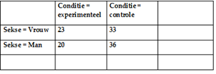

```{r, echo = FALSE, results = "hide"}
include_supplement("uva-twoway-anova-40-nl-graph01.png", recursive = TRUE)
```

Question
========

Given are the following averages for each condition in an experiment with the factor Condition and the factor Gender. What effects appear to be involved in this design?



Answerlist
----------

* A main effect of Gender and a main effect of Condition.
* A main effect of Condition and an interaction between Condition and Gender.
* A main effect of Gender, a main effect of Condition and an interaction between Condition and Gender.

Solution
========

Answerlist
----------

* A main effect of Gender and a main effect of Condition...: Incorrect
* A main effect of Condition and an interaction between Condition and Gender: Correct
* A main effect of Gender, a main effect of Condition and an interaction between Condition and Gender...: Incorrect

Meta-information
================
exname: uva-twoway-anova-40-en
extype: schoice
exsolution: 010
exsection: Inferential Statistics/Parametric Techniques/ANOVA/Twoway ANOVA
exextra[ID]: f6a98
exextra[Type]: Conceptual
exextra[Language]: English
exextra[Level]: Statistical Literacy
exextra[IRT-Difficulty]: 2.481
exextra[p-value]: 0.4719
