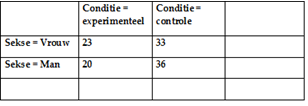

```{r, echo = FALSE, results = "hide"}
include_supplement("uva-twoway-anova-40-nl-graph01.png", recursive = TRUE)
```

Question
========

Gegeven zijn de volgende gemiddelden per conditie in een experiment met
de factor Conditie en de factor Sekse. Van welke effecten lijkt er in
dit design sprake?



Answerlist
----------

* Een hoofdeffect van Sekse en een hoofdeffect van Conditie.
* Een hoofdeffect van Conditie en een interactie tussen Conditie en Sekse.
* Een hoofdeffect van Sekse, een hoofdeffect van Conditie en een interactie tussen Conditie en Sekse.

Solution
========

Answerlist
----------

* Een hoofdeffect van Sekse en een hoofdeffect van Conditie.: Incorrect
* Een hoofdeffect van Conditie en een interactie tussen Conditie en Sekse.: Correct
* Een hoofdeffect van Sekse, een hoofdeffect van Conditie en een interactie tussen Conditie en Sekse.: Incorrect

Meta-information
================
exname: uva-twoway-anova-40-nl
extype: schoice
exsolution: 010
exsection: Inferential Statistics/Parametric Techniques/ANOVA/Twoway ANOVA
exextra[ID]: 207e9
exextra[Type]: Conceptual
exextra[Language]: Dutch
exextra[Level]: Statistical Literacy
exextra[IRT-Difficulty]: 2.481
exextra[p-value]: 0.4719
