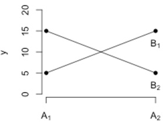

```{r, echo = FALSE, results = "hide"}
include_supplement("uva-twoway-anova-799-nl-graph01.png", recursive = TRUE)
```

Question
========

A *two-way* ANOVA with dependent variable *y* and factors A and B with two levels each (A1, A2, B1, B2) produces the following picture. What can you deduce from this?



Answerlist
----------

* There seems to be an interaction between y and factor A.
* There seems to be an interaction between factor A and factor B.
* The point where the lines cross says something about the relationship between factors A and B.

Solution
========

Answerlist
----------

* There seems to be an interaction between y and factor A.: Incorrect
* There seems to be an interaction between factor A and factor B.: Correct
* The point where the lines cross says something about the relationship between factors A and B.: Incorrect

Meta-information
================
exname: uva-twoway-anova-799-en
extype: schoice
exsolution: 010
exsection: Inferential Statistics/Parametric Techniques/ANOVA/Twoway ANOVA
exextra[ID]: b6928
exextra[Type]: Conceptual
exextra[Language]: English
exextra[Level]: Statistical Literacy
exextra[IRT-Difficulty]: -1.5
exextra[p-value]: 0.9551
