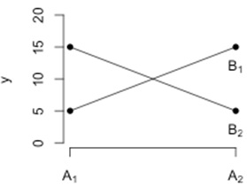

```{r, echo = FALSE, results = "hide"}
include_supplement("uva-twoway-anova-799-nl-graph01.png", recursive = TRUE)
```

Question
========

Een *two-way* ANOVA met afhankelijke variabele *y* en factoren A en B
met ieder twee niveaus (A1, A2, B1, B2) levert het volgende plaatje op.
Wat kun je hieruit opmaken?



Answerlist
----------

Er lijkt sprake van een interactie tussen y en factor A.
Er lijkt sprake van een interactie tussen factor A en factor B.
Het punt waar de lijnen kruisen zegt iets over de verhouding tussen factoren A en B.

Solution
========

Answerlist
----------

Er lijkt sprake van een interactie tussen y en factor A.: Incorrect
Er lijkt sprake van een interactie tussen factor A en factor B.: Correct
Het punt waar de lijnen kruisen zegt iets over de verhouding tussen factoren A en B.: Incorrect

Meta-information
================
exname: uva-twoway-anova-799-nl
extype: schoice
exsolution: 010
exsection: Inferential Statistics/Parametric Techniques/ANOVA/Twoway ANOVA
exextra[Type]: Conceptual
exextra[Language]: Dutch
exextra[Level]: Statistical Literacy
exextra[IRT-Difficulty]: -1.5
exextra[p-value]: 0.9551
