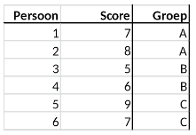

```{r, echo = FALSE, results = "hide"}
include_supplement("vufg-onewayanova-320-nl-table01.jpg", recursive = TRUE)
```

Question
========

The table below refers to a study in which individuals were randomly assigned to Group A, B or C. Calculate the mean square error within groups (MS within).


  
Answerlist
----------
* 1
* 2
* 3
* 3.5

Solution
========

Answerlist
----------
* Incorrect
* Incorrect
* Incorrect
* Correct

Meta-information
================
exname: vufg-onewayanova-320-en
extype: schoice
exsolution: 0001
exsection: Inferential Statistics/Parametric Techniques/ANOVA/Oneway ANOVA
exextra[ID]: d6efa
exextra[Type]: Calculation, Interpreting output
exextra[Program]: 
exextra[Language]: English
exextra[Level]: Statistical Literacy
