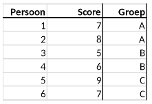

```{r, echo = FALSE, results = "hide"}
include_supplement("vufg-onewayanova-320-nl-table01.jpg", recursive = TRUE)
```

Question
========

Onderstaande tabel heeft betrekking op een onderzoek waarbij personen gerandomiseerd zijn toegewezen aan Groep A,  B of C.  Bereken de mean square error binnen groepen (MS within).


  
Answerlist
----------
* 1
* 2
* 3
* 3.5

Solution
========

Answerlist
----------
* Incorrect
* Incorrect
* Incorrect
* Correct

Meta-information
================
exname: vufg-onewayanova-320-nl
extype: schoice
exsolution: 0001
exsection: Inferential Statistics/Parametric Techniques/ANOVA/Oneway ANOVA
exextra[ID]: 3a086
exextra[Type]: Calculation, Interpreting output
exextra[Program]: 
exextra[Language]: Dutch
exextra[Level]: Statistical Literacy
