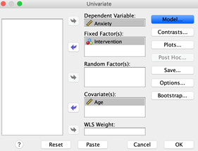

```{r, echo = FALSE, results = "hide"}
include_supplement("vufgb-ancova-004-nl.png", recursive = TRUE)
```

Question
========
Soumaya voert in SPSS in de *General Linear Model - Univariate* module de volgende variabelen in. 



Welke statistische analyse voert hij uit?

Answerlist
----------
* Een logistische regressie-analyse.
* Een *linear mixed model* analyse.
* Een factoriele ANOVA-analyse.
* Een ANCOVA-analyse.

Meta-information
================
exname: vufgb-ancova-004-nl
extype: schoice
exsolution: 0001
exsection: Inferential Statistics/Parametric Techniques/ANOVA/ANCOVA
exextra[Type]: Case, Test choice
exextra[Language]: Dutch
exextra[Level]: Statistical Literacy