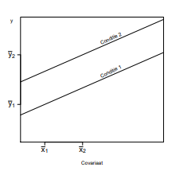

```{r, echo = FALSE, results = "hide"}
include_supplement("vufgb-ancova-007-nl-graph01.jpg", recursive = TRUE)
```

Question
========
  
In het onderstaande plaatje staat de predictievergelijking weergegeven van een Ancova waarbij de factor twee niveau’s heeft. Ook de (niet gecorrigeerde) gemiddelden voor x en y staan afgebeeld. Wat kan er worden geconcludeerd over de verschillen tussen de ongecorrigeerde (unadjusted) gemiddelden ($\overline{y}$'s) enerzijds en gecorrigeerde (adjusted) gemiddelden ($\overline{{y}}'$'s) anderzijds?


  
Door het corrigeren voor de Covariaat  
  
Answerlist
----------
* wordt het verschil tussen de condities groter.
* wordt het verschil tussen de condities kleiner.
* verandert het teken (+/−) van het verschil.
* veranderen de verschillen niet.


Solution
========

Answerlist
----------
* Correct
* Incorrect
* Incorrect
* Incorrect

Meta-information
================
exname: vufgb-ancova-007-nl
extype: schoice
exsolution: 1000
exsection: Inferential Statistics/Parametric Techniques/ANOVA/ANCOVA, Inferential Statistics/Regression
exextra[Type]: Conceptual
exextra[Program]: 
exextra[Language]: Dutch
exextra[Level]: Statistical Literacy
