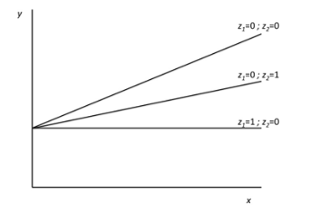

```{r, echo = FALSE, results = "hide"}
include_supplement("vufgb-ancova-011-nl-graph01.jpg", recursive = TRUE)
```

Question
========

Given is the figure below. Which model is depicted here?


  
Answerlist
----------
* An ANCOVA model with 1 factor and 1 covariate.
* A regression model with 1 quantitative independent variable and 2 dummy variables.
* A general linear model with interaction between 1 quantitative and 1 categorical variable.
* Answers a, b and c are all correct.

Solution
========

Answerlist
----------
* Incorrect
* Incorrect
* Incorrect
* Correct

Meta-information
================
exname: vufgb-ancova-011-en
extype: schoice
exsolution: 0001
exsection: Inferential Statistics/Parametric Techniques/ANOVA/ANCOVA, Inferential Statistics/Regression/Multiple linear regression
exextra[ID]: 709a3
exextra[Type]: Interpreting graph, Conceptual
exextra[Program]: 
exextra[Language]: English
exextra[Level]: Statistical Literacy
