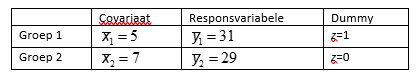

```{r, echo = FALSE, results = "hide"}
include_supplement("vufgb-ancova-017-nl-table01.jpg", recursive = TRUE)
```

Question
========

Given are the following raw averages for response variable *y* and covariate *x* and dummy coding into two groups. The estimated covariance model is as follows: $\hat{y} = 10+3x+5z$. What can one conclude about the raw differences on *y* on the one hand and the adjusted ('adjusted') averages on the other? The adjusted averages...


  
Answerlist
----------
* ...differ more than the raw averages.
* ...differ less than the raw averages.
* ...have a different ranking than the raw averages.
* ...do not differ from the raw averages.


Solution
========

Answerlist
----------
* Correct
* Incorrect
* Incorrect
* Incorrect

Meta-information
================
exname: vufgb-ancova-017-en
extype: schoice
exsolution: 1000
exsection: Inferential Statistics/Parametric Techniques/ANOVA/ANCOVA, Inferential Statistics/Regression/Dummies
exextra[ID]: dfe0a
exextra[Type]: Interpreting output
exextra[Program]: 
exextra[Language]: English
exextra[Level]: Statistical Literacy
