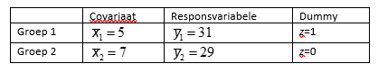

```{r, echo = FALSE, results = "hide"}
include_supplement("vufgb-ancova-017-nl-table01.jpg", recursive = TRUE)
```

Question
========

Gegeven zijn de volgende ruwe gemiddelden voor responsvariabele *y* en covariaat *x* en de dummycodering in twee groepen. Het geschatte covariantiemodel ziet er als volgt uit: $\hat{y} = 10+3x+5z$. Wat kan men concluderen over de ruwe verschillen op *y* enerzijds en de aangepaste (‘adjusted’) gemiddelden anderzijds? De aangepaste gemiddelden…


  
Answerlist
----------
* ...verschillen meer dan de ruwe gemiddelden.
* ...verschillen minder dan de ruwe gemiddelden.
* ...hebben een andere rangschikking dan de ruwe gemiddelden.
* ...verschillen niet van de ruwe gemiddelden.


Solution
========

Answerlist
----------
* Correct
* Incorrect
* Incorrect
* Incorrect

Meta-information
================
exname: vufgb-ancova-017-nl
extype: schoice
exsolution: 1000
exsection: Inferential Statistics/Parametric Techniques/ANOVA/ANCOVA, Inferential Statistics/Regression/Dummies
exextra[Type]: Interpreting output
exextra[Program]: 
exextra[Language]: Dutch
exextra[Level]: Statistical Literacy