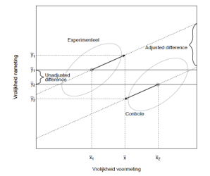

```{r, echo = FALSE, results = "hide"}
include_supplement("vufgb-ancova-021-nl-figure01.jpg", recursive = TRUE)
```

Question
========

An ANCOVA analysis leads to averages for Cheerfulness on the post-measurement for both the experimental and control groups corrected for Cheerfulness on the premeasurement. The results are shown schematically in the figure. Which statement about the results is correct?


  
Answerlist
----------
* After controlling for the covariate, the differences between groups decreased.
* In the experimental group, cheerfulness increases, and in the control group it decreases.
* The experimental and control groups do not differ in cheerfulness on the pre-measurement, but they do on the post-measurement.
* The control group is more cheerful than the experimental group on the pre-measurement, but on the post-measurement it is reversed.

Solution
========

Answerlist
----------
* Incorrect
* Incorrect
* Incorrect
* Correct

Meta-information
================
exname: vufgb-ancova-021-en
extype: schoice
exsolution: 0001
exsection: Inferential Statistics/Parametric Techniques/ANOVA/ANCOVA
exextra[ID]: bbb20
exextra[Type]: Interpreting graph
exextra[Program]: 
exextra[Language]: English
exextra[Level]: Statistical Literacy
