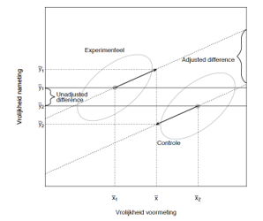

```{r, echo = FALSE, results = "hide"}
include_supplement("vufgb-ancova-021-nl-figure01.jpg", recursive = TRUE)
```

Question
========

Een ANCOVA analyse leidt tot gemiddelden voor Vrolijkheid op de nameting voor zowel de experimentele als controle groep die gecorrigeerd zijn voor Vrolijkheid op de voormeting. De resultaten zijn schematisch weergegeven in de figuur. Welke uitspraak over de resultaten is juist?


  
Answerlist
----------
* Na controleren voor de covariaat zijn de verschillen tussen groepen kleiner geworden.
* In de experimentele groep neemt vrolijkheid toe, en in de controle groep juist af.
* De experimentele en controle groep verschillen niet in vrolijkheid op de voormeting, maar wel op de nameting.
* De controle groep is vrolijker dan de experimentele groep op de voormeting, maar op de nameting is het omgekeerd.

Solution
========

Answerlist
----------
* Incorrect
* Incorrect
* Incorrect
* Correct

Meta-information
================
exname: vufgb-ancova-021-nl
extype: schoice
exsolution: 0001
exsection: Inferential Statistics/Parametric Techniques/ANOVA/ANCOVA
exextra[Type]: Interpreting graph
exextra[Program]: 
exextra[Language]: Dutch
exextra[Level]: Statistical Literacy