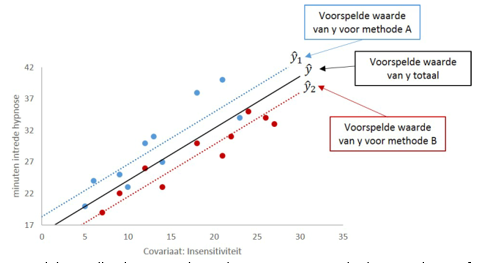

```{r, echo = FALSE, results = "hide"}
include_supplement("vufgb-ancova-024-nl-figure01.jpg", recursive = TRUE)
```

Question
========

Given is the figure below that belongs to the outcomes of an ANCOVA model. Which statement about the outcomes is TRUE?


  
Answerlist
----------
* The difference in speed of entry of hypnosis between method A and B depends on the degree of insensitivity.
* The strength of the linear relationship between insensitivity and speed of entry of hypnosis depends on method A or B.
* If insensitivity is held constant, method B leads to faster onset of hypnosis than method A.
* If insensitivity is held constant, method A leads to faster onset of hypnosis than method B.

Solution
========

Answerlist
----------
* Incorrect
* Incorrect
* Correct
* Incorrect

Meta-information
================
exname: vufgb-ancova-024-en
extype: schoice
exsolution: 0010
exsection: Inferential Statistics/Parametric Techniques/ANOVA/ANCOVA, Descriptive statistics/Data representation/Graphs/Scatterplot
exextra[Type]: Interpreting graph
exextra[Program]: 
exextra[Language]: English
exextra[Level]: Statistical Literacy
