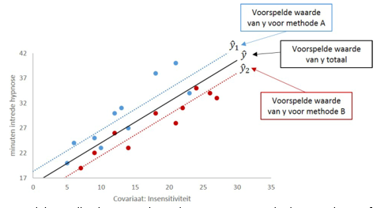

```{r, echo = FALSE, results = "hide"}
include_supplement("vufgb-ancova-024-nl-figure01.jpg", recursive = TRUE)
```

Question
========

Gegeven is onderstaande figuur die hoort bij de uitkomsten van een ANCOVA model. Welke uitspraak over de uitkomsten is waar?


  
Answerlist
----------
* Het verschil in snelheid van intrede van hypnose tussen methode A en B hangt af van de mate van insensitiviteit.
* De sterkte van het lineaire verband tussen insensitiviteit en snelheid van intrede van hypnose hangt af van methode A of B.
* Als insensitiviteit constant wordt gehouden, leidt methode B tot een snellere intrede van hypnose dan methode A.
* Als insensitiviteit constant wordt gehouden, leidt methode A tot een snellere intrede van hypnose dan methode B.

Solution
========

Answerlist
----------
* Incorrect
* Incorrect
* Correct
* Incorrect

Meta-information
================
exname: vufgb-ancova-024-nl
extype: schoice
exsolution: 0010
exsection: Inferential Statistics/Parametric Techniques/ANOVA/ANCOVA, Descriptive statistics/Data representation/Graphs/Scatterplot
exextra[Type]: Interpreting graph
exextra[Program]: 
exextra[Language]: Dutch
exextra[Level]: Statistical Literacy