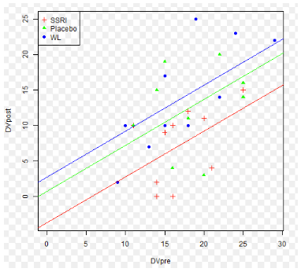

```{r, echo = FALSE, results = "hide"}
include_supplement("vufgb-ancova-030-nl-figure01.jpg", recursive = TRUE)
```

Question
========

A researcher is interested in the effect of medication use on depressive symptoms of women during pregnancy. She randomly divides a sample of women into a group that receives antidepressants (SSRI), receives a placebo (Placebo), or is placed on a waiting list (WL). She does a pretest and posttest of depressive symptoms (DVpre and DVpost, respectively). She conducts an analysis and creates the figure below.

What analysis technique did she use?


  
Answerlist
----------
* One-way analysis of variance ('One-way ANOVA')
* Two-way analysis of variance ('Two-way ANOVA')
* Three-way analysis of variance ('Three-way ANOVA')
* Covariance analysis (ANCOVA)

Solution
========

Answerlist
----------
* Incorrect
* Incorrect
* Incorrect
* Correct

Meta-information
================
exname: vufgb-ancova-030-en
extype: schoice
exsolution: 0001
exsection: Inferential Statistics/Parametric Techniques/ANOVA/ANCOVA
exextra[ID]: fbd2b
exextra[Type]: Interpreting graph, Test choice
exextra[Program]: 
exextra[Language]: English
exextra[Level]: Statistical Literacy
