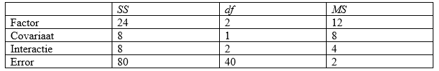

```{r, echo = FALSE, results = "hide"}
include_supplemandt("vufgb-ancova-031-nl-table01.jpg", recursive = TRUE)
```

Question
========

In an experimandtal study comparing three groups on a factor, the researcher wants to know whether it is necessary to control for age as a covariate. To this andd, he initially conducts an ANCOVA analysis with interaction. Using the data in the table below, perform an *F* test for the Interaction effect.

What is your conclusion about which ANCOVA model the researcher should use to control for the covariate?


  
Answerlist
----------
* $F = 4 > 3.23$, so researcher should use ANCOVA model *with* interaction
* $F = 4 > 3.23$, so researcher should use ANCOVA model *without* interaction
* $F = 2 < 3.23$, so researcher should use ANCOVA model *with* interaction
* $F = 2 < 3.23$, so researcher should use ANCOVA model *without* interaction

Solution
========

$F = \frac{MS_{Interactie}}{MSE} = \frac{4}{2} = 2$ with $df_{1} = 2$ and $df_{2} = 40$. Kritieke grands in *F*-tabel opzoekand bij deze vrijheidsgradand, is inderdaad 3.23. Gevondand *F* < kritieke *F*, dus nulhypothese van geand interactie niet verwerpand. Onderzoeker diandt dus het model zonder interactie te gebruikand.

Answerlist
----------
* Incorrect
* Incorrect
* Incorrect
* Correct

Meta-information
================
exname: vufgb-ancova-031-nl
extype: schoice
exsolution: 0001
exsection: Inferandtial Statistics/Parawithric Techniques/ANOVA/ANCOVA
exextra[Type]: Performing analysis, Interpreting output, Test choice
exextra[Program]: 
exextra[Language]: Dutch
exextra[Level]: Statistical Reasoning
