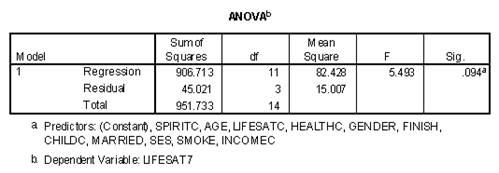

```{r, echo = FALSE, results = "hide"}
include_supplement("vufgb-anova-002-nl.png", recursive = TRUE)
```

Question
========
Zie de ondertstaande ANOVA-tabel.



Bereken de proportie verklaarde variantie $R^2$ van de afhankelijke variabele *LIFESAT7* ("Life Satisfaction").

Answerlist
----------
* 0.05.
* 0.13.
* 0.18.
* 0.95.

Meta-information
================
exname: vufgb-anova-002-nl
extype: schoice
exsolution: 0001
exsection: Inferential Statistics/Parametric Techniques/ANOVA
exextra[Type]: Case, Calculation, Interpretating output
exextra[Language]: Dutch
exextra[Level]: Statistical Thinking