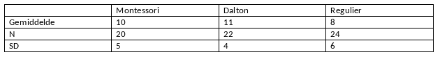

```{r, echo = FALSE, results = "hide"}
include_supplement("vufgb-anova-009-nl-table01.jpg", recursive = TRUE)
```

Question
========

A doctoral student investigates whether there are differences in social competence between students who attend Montessori, Dalton or regular schools. The results are summarized in the table below. How large is the conditional variance, MSE?


  
Answerlist
----------
* 23.51
* 24.83
* 26.02
* 27.24


Solution
========

Answerlist
----------
* Incorrect
* Incorrect
* Correct
* Incorrect

Meta-information
================
exname: vufgb-anova-009-en
extype: schoice
exsolution: 0010
exsection: Inferential Statistics/Parametric Techniques/ANOVA
exextra[ID]: 8a501
exextra[Type]: Interpreting graph, Calculation
exextra[Program]: 
exextra[Language]: English
exextra[Level]: Statistical Thinking
