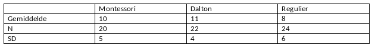

```{r, echo = FALSE, results = "hide"}
include_supplement("vufgb-anova-009-nl-table01.jpg", recursive = TRUE)
```

Question
========

Een promovendus onderzoekt of er verschillen zijn in sociale competentie tussen leerlingen die Montessori-, Dalton- of regulier onderwijs volgen. De resultaten staan in onderstaande tabel samengevat. Hoe groot is de conditionele variantie, MSE?


  
Answerlist
----------
* 23.51 
* 24.83
* 26.02
* 27.24


Solution
========

Answerlist
----------
* Incorrect
* Incorrect
* Correct
* Incorrect

Meta-information
================
exname: vufgb-anova-009-nl
extype: schoice
exsolution: 0010
exsection: Inferential Statistics/Parametric Techniques/ANOVA
exextra[Type]: Interpreting graph, Calculation
exextra[Program]: 
exextra[Language]: Dutch
exextra[Level]: Statistical Thinking
