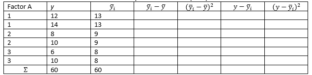

```{r, echo = FALSE, results = "hide"}
include_supplement("vufgb-anova-013-nl-table01.jpg", recursive = TRUE)
```

Question
========

Given is the incomplete ANOVA calculation table below. The overall mean $\overline{y}$ is 10. Complete the table and calculate the Mean Square of Factor A (MSA).


  
Answerlist
----------
* 28
* 14
* 12
* 4


Solution
========

Answerlist
----------
* Incorrect
* Correct
* Incorrect
* Incorrect

Meta-information
================
exname: vufgb-anova-013-en
extype: schoice
exsolution: 0100
exsection: Inferential Statistics/Parametric Techniques/ANOVA
exextra[Type]: Calculation
exextra[Program]: 
exextra[Language]: English
exextra[Level]: Statistical Thinking
