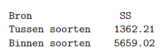

```{r, echo = FALSE, results = "hide"}
include_supplement("vufgb-anova-015-nl-table01.jpg", recursive = TRUE)
```

Question
========

A study compares three species of fruit flies (N = 75) on their fertility. The following (incomplete) ANOVA table is the result:


  
What is the variance on the variable fertility?  
  
Answerlist
----------
* 94.88
* 93.62
* 78.60
* 76.47

Solution
========

Answerlist
----------
* Correct
* Incorrect
* Incorrect
* Incorrect

Meta-information
================
exname: vufgb-anova-015-en
extype: schoice
exsolution: 1000
exsection: Inferential Statistics/Parametric Techniques/ANOVA, Descriptive statistics/Summary Statistics/Measures of Spread/Variance
exextra[ID]: 1c074
exextra[Type]: Interpreting output, Calculation
exextra[Program]: 
exextra[Language]: English
exextra[Level]: Statistical Literacy
