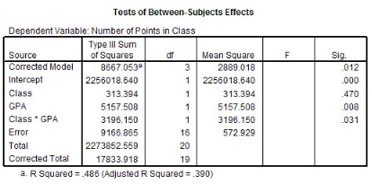

```{r, echo = FALSE, results = "hide"}
include_supplement("vufgb-anova-017-nl-table01.jpg", recursive = TRUE)
```

Question
========

A researcher conducted a Factorial ANOVA to examine whether the correlation between GPA (Grade Point Average) scores and inter-class (class) is related to the number of points participants receive from the teacher for class participation (nr of points in class). Calculate the F-value associated with "GPA":


  
Answerlist
----------
* 9.002
* 0.547
* 0.034
* 1.828

Solution
========

Answerlist
----------
* Correct
* Incorrect
* Incorrect
* Incorrect

Meta-information
================
exname: vufgb-anova-017-en
extype: schoice
exsolution: 1000
exsection: Inferential Statistics/Parametric Techniques/ANOVA, Inferential Statistics/Parametric Techniques/ANOVA/ANOVA F-test
exextra[ID]: efca3
exextra[Type]: Interpreting output, Calculation
exextra[Program]: SPSS
exextra[Language]: English
exextra[Level]: Statistical Literacy
