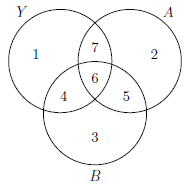

```{r, echo = FALSE, results = "hide"}
include_supplement("vufgb-anova-019-nl-venndiagram01.jpg", recursive = TRUE)
```

Question
========

In an ANOVA, the main effects of Factor A and Factor B are included. The study in question has an unbalanced design, resulting in the overlap below. What explained variance is attributed to Factor A if Type III quadratic sums are determined and Factor A is placed first in the model?


  
Answerlist
----------
* 2+5+6+7
* 5+6+7
* 6+7
* 7


Solution
========

Answerlist
----------
* Incorrect
* Incorrect
* Incorrect
* Correct

Meta-information
================
exname: vufgb-anova-019-en
extype: schoice
exsolution: 0001
exsection: Inferential Statistics/Parametric Techniques/ANOVA, Descriptive statistics/Data representation/Graphs/Venn diagram
exextra[ID]: e5082
exextra[Type]: Interpreting graph, Conceptual
exextra[Program]: 
exextra[Language]: English
exextra[Level]: Statistical Literacy
