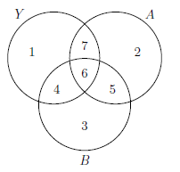

```{r, echo = FALSE, results = "hide"}
include_supplement("vufgb-anova-021-nl-venndiagram01.jpg", recursive = TRUE)
```

Question
========

In an ANOVA, the main effects of Factor A and Factor B are included. The study in question has an unbalanced design, resulting in the overlap below. What explained variance of Y is attributed to Factor B if Type I squares are determined and Factor B is placed first in the model?


  
Answerlist
----------
* 4 + 5 + 6
* 4 + 7
* 4 + 6
* 4

Solution
========

Answerlist
----------
* Incorrect
* Incorrect
* Correct
* Incorrect

Meta-information
================
exname: vufgb-anova-021-en
extype: schoice
exsolution: 0010
exsection: Inferential Statistics/Parametric Techniques/ANOVA, Descriptive statistics/Data representation/Graphs/Venn diagram
exextra[Type]: Interpreting graph
exextra[Program]: 
exextra[Language]: English
exextra[Level]: Statistical Literacy
