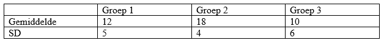

```{r, echo = FALSE, results = "hide"}
include_supplement("vufgb-anova-024-nl-table01.jpg", recursive = TRUE)
```

Question
========

A study examines exploration behavior (measured by the duration of play with toys) in three equally sized groups of 12-month-old infants with different attachment ratings (Group 1: Secure, Group 2: Insecure-Avoidant, Group 3: Insecure-Ambivalent). The total sample consists of 30 infants. The table below shows the mean duration of play with toys for each group, and the standard deviation.

How large is the Mean Square Within ($MS_{Within}$) of the ANOVA model?


  
Answerlist
----------
* 23.1
* 25.7
* 693
* 770

Solution
========

$MS_{Within} = \sum{\frac{(y_{i}-y_{g})^2}{(N-g)}}$. The numerator can be rewritten as: $\sum{(y_{i}-y_{1})^2} + \sum{(y_{i}-y_{2})^2} + \sum{(y_{i}-y_{3})^2}$. These quadratic sums can be derived from the SD within each group.

For example: $SD_{1}=\sqrt{\sum{\frac{(y_{i}-y_{1})^2}{(n_{1}-1)}}}$. Rewriting gives: $\sum{(y_{i}-y_{1})^2} = SD_{1}^{2} \times (n_{1}-1)$.

Entering in the numerator for the formula for $MS_{Within}$ gives: $MS_{Within}= \frac{SD_{1}^{2} \times (n_{1}-1) + SD_{2}^{2} \times (n_{2}-1) + SD_{3}^{2} \times (n_{3}-1)}{(N-g)} =  \frac{5^2 \times 9 + 4^2 \times 9 + 6^2 \times 9}{(30-3)} =  \frac{693}{27}=25.7$.

Answerlist
----------
* Incorrect
* Correct
* Incorrect
* Incorrect

Meta-information
================
exname: vufgb-anova-024-en
extype: schoice
exsolution: 0100
exsection: Inferential Statistics/Parametric Techniques/ANOVA, Inferential Statistics/Regression/Sum of squares
exextra[Type]: Interpreting output, Calculation
exextra[Program]: 
exextra[Language]: English
exextra[Level]: Statistical Thinking
