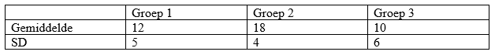

```{r, echo = FALSE, results = "hide"}
include_supplement("vufgb-anova-024-nl-table01.jpg", recursive = TRUE)
```

Question
========

In een onderzoek wordt het exploratiegedrag (gemeten aan hand van de duur van spelen met speelgoed) bestudeerd in drie even grote groepen van 12-maanden oude baby’s met een verschillende gehechtheidsclassificatie (Groep 1: Veilig, Groep 2: Onveilig-Vermijdend, Groep 3: Onveilig-Ambivalent). De totale steekproef bestaat uit 30 baby’s. In onderstaande tabel staat voor elke groep de gemiddelde duur van spelen met speelgoed, en de standaarddeviatie. 

Hoe groot is de Mean Square Within ($MS_{Within}$) van het ANOVA model?


  
Answerlist
----------
* 23.1
* 25.7
* 693
* 770

Solution
========

$MS_{Within} = \sum{\frac{(y_{i}-y_{g})^2}{(N-g)}}$. De teller kan herschreven worden als: $\sum{(y_{i}-y_{1})^2} + \sum{(y_{i}-y_{2})^2} + \sum{(y_{i}-y_{3})^2}$. Deze kwadratensommen kunnen afgeleid worden uit de SD binnen elke groep.

Er geldt bijvoorbeeld: $SD_{1}=\sqrt{\sum{\frac{(y_{i}-y_{1})^2}{(n_{1}-1)}}}$. 
Herschrijven geeft: $\sum{(y_{i}-y_{1})^2} = SD_{1}^{2} \times (n_{1}-1)$. 

Invullen in de teller voor de formule voor $MS_{Within}$ geeft: $MS_{Within}= \frac{SD_{1}^{2} \times (n_{1}-1) + SD_{2}^{2} \times (n_{2}-1) + SD_{3}^{2} \times (n_{3}-1)}{(N-g)} =  \frac{5^2 \times 9 + 4^2 \times 9 + 6^2 \times 9}{(30-3)} =  \frac{693}{27}=25.7$.

Answerlist
----------
* Incorrect
* Correct
* Incorrect
* Incorrect

Meta-information
================
exname: vufgb-anova-024-nl
extype: schoice
exsolution: 0100
exsection: Inferential Statistics/Parametric Techniques/ANOVA, Inferential Statistics/Regression/Sum of squares
exextra[ID]: 623a4
exextra[Type]: Interpreting output, Calculation
exextra[Program]: 
exextra[Language]: Dutch
exextra[Level]: Statistical Thinking
