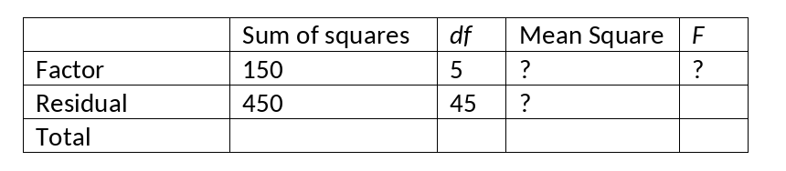

```{r, echo = FALSE, results = "hide"}
include_supplement("vufgb-anovaftest-001-en-graph-01.png", recursive = TRUE)
```
Question
========
  
Please complete the following table with results of a oneway ANOVA. What is the *F*-value, and what does this mean?


  
Answerlist
----------
* *F* = 3.00, the variance between groups is larger than the variance within groups.
* *F* = 0.33, the variance between groups is smaller than the variance within groups.
* *F* = 3.00, the variance within groups is larger than the variance between groups.
* *F* = 0.33, the variance within groups is smaller than the variance between groups.

Solution
========

Answerlist
----------
* Correct
* Incorrect
* Incorrect
* Incorrect

Meta-information
================
exname: vufgb-anovaftest-001-en
extype: schoice
exsolution: 1000
exsection: Inferential Statistics/Parametric Techniques/ANOVA/ANOVA F-test, Inferential Statistics/Parametric Techniques/ANOVA/Oneway ANOVA,
exextra[Type]: Calculation, Conceptual
exextra[Language]: English
exextra[Level]: Statistical Thinking