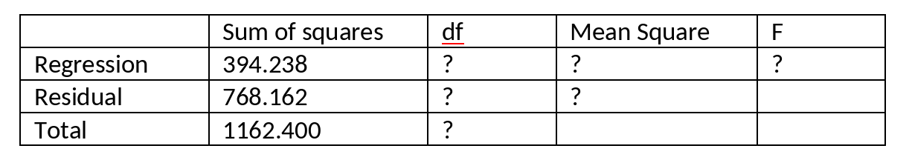

```{r, echo = FALSE, results = "hide"}
include_supplement("vufgb-anovaftest-002-en-graph-01.png", recursive = TRUE)
```
Question
========
  
Given is the following incomplete ANOVA table belonging to a multiple regression model with two predictors without interaction, conducted in a sample of 40 persons. Calculate the *F*-value.

 
  
Answerlist
----------
* 6.43
* 6.60
* 9.49
* 9.75

Solution
========

Answerlist
----------
* Incorrect
* Incorrect
* Correct
* Incorrect

Meta-information
================
exname: vufgb-anovaftest-002-en
extype: schoice
exsolution: 0010
exsection: Inferential Statistics/Parametric Techniques/ANOVA/ANOVA F-test
exextra[ID]: 24407
exextra[Type]: Calculation
exextra[Language]: English
exextra[Level]: Statistical Thinking
