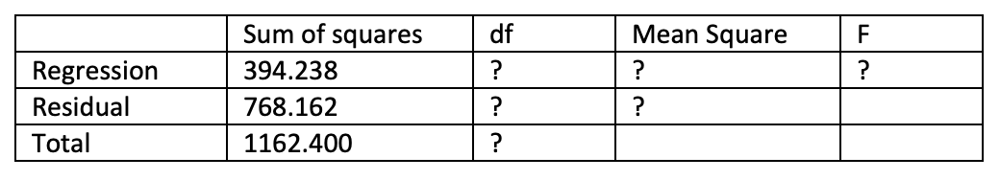

```{r, echo = FALSE, results = "hide"}
include_supplement("vufgb-anovaftest-003-nl-graph-01.png", recursive = TRUE)
```
Question
========
  
Gegeven is onderstaande incomplete ANOVA tabel behorende bij een meervoudig regressiemodel met twee predictoren zonder interactie, uitgevoerd in een steekproef van 40 personen. Bereken de *F*-waarde.

 
  
Answerlist
----------
* 6.43
* 6.60
* 9.49
* 9.75

Solution
========

Answerlist
----------
* Incorrect
* Incorrect
* Correct
* Incorrect

Meta-information
================
exname: vufgb-anovaftest-003-nl
extype: schoice
exsolution: 0010
exsection: Inferential Statistics/Parametric Techniques/ANOVA/ANOVA F-test
exextra[Type]: Calculation
exextra[Language]: Dutch
exextra[Level]: Statistical Thinking
