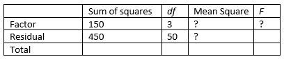

```{r, echo = FALSE, results = "hide"}
include_supplement("vufgb-anovaftest-004-en-table01.jpg", recursive = TRUE)
```

Question
========

Please complete the following table with results of a oneway ANOVA. What is the *F*-value, and what does this mean?


  
Answerlist
----------
* *F* = 5.56, the variance between groups is larger than the variance within groups.
* *F* = 0.18, the variance between groups is smaller than the variance within groups.
* *F* = 5.56, the variance within groups is larger than the variance between groups.
* *F* = 0.18, the variance within groups is smaller than the variance between groups.

Solution
========

Answerlist
----------
* Correct
* Incorrect
* Incorrect
* Incorrect

Meta-information
================
exname: vufgb-anovaftest-004-en
extype: schoice
exsolution: 1000
exsection: Inferential Statistics/Parametric Techniques/ANOVA/ANOVA F-test
exextra[ID]: 017fd
exextra[Type]: Calculation, Interpreting output
exextra[Program]: 
exextra[Language]: Dutch
exextra[Level]: Statistical Thinking
