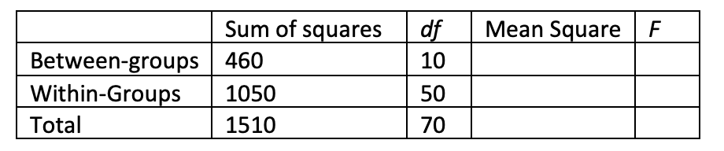

```{r, echo = FALSE, results = "hide"}
include_supplement("vufgb-anovaftest-004-nl-graph-01.png", recursive = TRUE)
```
Question
========
  
Gegeven is onderstaande ANOVA tabel voor een eenwegs ANOVA. Bereken de *F*-waarde.

 
  
Answerlist
----------
* 0.30.
* 0.44.
* 2.13.
* 2.19

Solution
========

Answerlist
----------
* Incorrect
* Incorrect
* Incorrect
* Correct

Meta-information
================
exname: vufgb-anovaftest-004-nl
extype: schoice
exsolution: 0001
exsection: Inferential Statistics/Parametric Techniques/ANOVA/ANOVA F-test
exextra[ID]: 69d35
exextra[Type]: Calculation
exextra[Language]: Dutch
exextra[Level]: Statistical Thinking
