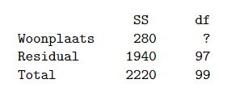

```{r, echo = FALSE, results = "hide"}
include_supplement("vufgb-anovaftest-005-nl-table01.jpg", recursive = TRUE)
```

Question
========

Bereken met behulp van onderstaande ANOVA tabel de F-waarde die hoort bij de toets van de nulhypothese dat mensen die wonen in Amsterdam, Den Haag of Rotterdam even tevreden zijn met hun woonomgeving.


  
Answerlist
----------
* 4.7
* 4.6
* 1.1
* 7.0

Solution
========

Answerlist
----------
* Incorrect
* Incorrect
* Incorrect
* Correct

Meta-information
================
exname: vufgb-anovaftest-005-nl
extype: schoice
exsolution: 0001
exsection: Inferential Statistics/Parametric Techniques/ANOVA/ANOVA F-test
exextra[Type]: Calculation
exextra[Program]: 
exextra[Language]: Dutch
exextra[Level]: Statistical Thinking