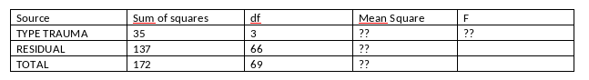

```{r, echo = FALSE, results = "hide"}
include_supplement("vufgb-anovaftest-007-nl-table01.jpg", recursive = TRUE)
```

Question
========

In a study of differences in temperament in children who have previously experienced different types of trauma, the following ANOVA table is found. Complete the table and calculate the F value. 



  
Answerlist
----------
* 5.62
* 4.69
* 3.91
* 0.20


Solution
========

Answerlist
----------
* Correct
* Incorrect
* Incorrect
* Incorrect

Meta-information
================
exname: vufgb-anovaftest-007-en
extype: schoice
exsolution: 1000
exsection: Inferential Statistics/Parametric Techniques/ANOVA/ANOVA F-test, Descriptive statistics/Data representation/Tables
exextra[Type]: Calculation
exextra[Program]: 
exextra[Language]: English
exextra[Level]: Statistical Thinking
